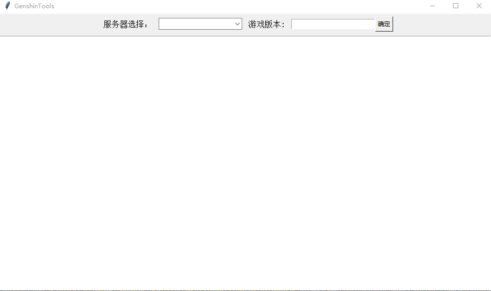

# GenshinTools

This is a python script for Genshin Impact. It can output game files with direct links for downloads.The links are generated in a output file.You can also view it on the GUI interface.

# How to use

This script runs on Windows 10. You need to install the python modules.

> Use pip to install the module

```
pip install requests tkinter jsonpath
```

> Run in the terminal

```
 py .\GenshinTools.py
```

# Example

The program runs on the interface.



How to obtain version 5.0.

